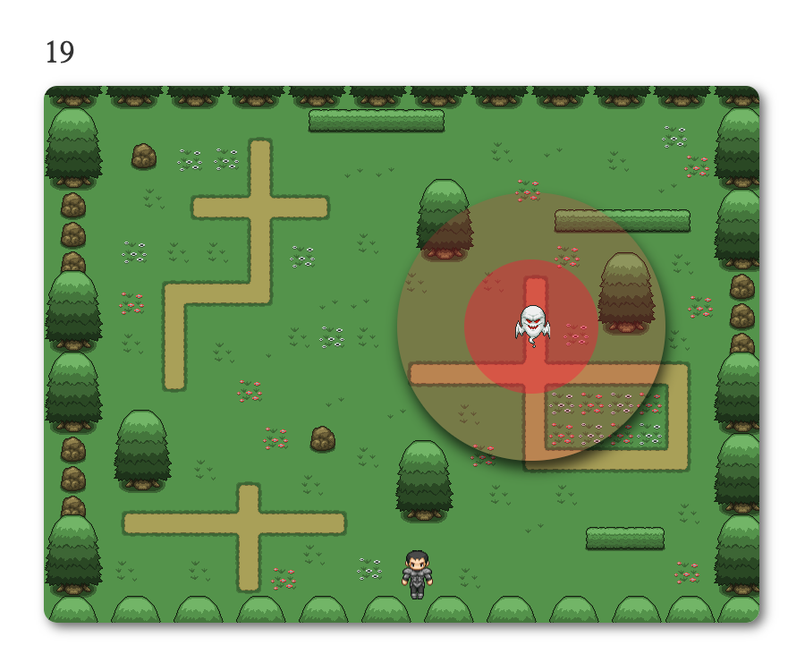

# enemy-rain
- JavaScript mini game with >wecode

# 사용 기술
- HTML5, CSS3, Vanilla JavaScript

# 게임 방법

- 시간 제한 60초
- 플레이어는 방향키를 통해 상, 하, 좌, 우 이동 가능
- 유령은 1초마다 랜덤하게 이동
- 플레이어가 직선상으로 유령과 동일한 라인에 위치할 경우 WARNING!!! 출력
- 유령의 진한 빨간색 반경 안으로 플레이어가 들어갈 경우 YOU DIE!!! 출력
- 플레이어 60초 동안 생존할 경우 YOU SURVIVE!!! 출력
- 플레이어가 60초 동안 생존하거나 제한 시간 안에 사망할 경우 카운트다운과 유령의 이동 멈춤
- 카운트다운과 유령의 동 멈출 경우 RESTART 버튼 출력

### [플레이 링크](https://codeameba.github.io/enemy-rain/)